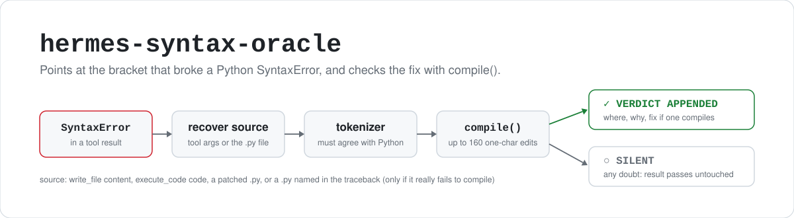

<p align="center">
  <picture>
    <source media="(prefers-color-scheme: dark)" srcset="assets/hero-dark.svg">
    
  </picture>
</p>

<p align="center">
  <a href="https://github.com/CocaKova/hermes-syntax-oracle/actions/workflows/ci.yml"></a>
  
  
  
  <a href="LICENSE"></a>
</p>

syntax-oracle is a [Hermes Agent](https://github.com/NousResearch/hermes-agent) plugin for agents
that write Python. When a tool result contains a `SyntaxError`, `IndentationError` or `TabError`, it
replays Python's tokenizer over the source, works out which bracket is unclosed, surplus or the wrong
kind, and appends that to the tool result together with a one-character fix it has checked with
`compile()`. Small local models are bad at counting brackets and can't tell that they are. Given a
bracket error they tend to blame the tools; this hands them the answer instead. It speaks only when
its finding agrees with Python's own message, blocks nothing, and uses the standard library only.

```
🔎 syntax-oracle — deterministic diagnosis from Python's tokenizer, not a guess:
  line 38: `{` opened at col 26 is never closed — the `]` at col 89 closes the outer bracket while that brace is still open.
      where_note = json.dumps([{"parentType": {"eq": "Opportunity"}, {"parentId": {"eq": oid}}])
                               ^ opened here                                                  ^ `]` arrives here, `{` still open
    Fix: add the missing `}` before the `]` (or delete a surplus `{`).
  ✔ Verified one-edit fix (the whole file compiles after this): insert `}` at line 38 col 89
      where_note = json.dumps([{"parentType": {"eq": "Opportunity"}, {"parentId": {"eq": oid}}▁])
                                                                                                ^ insert `}` here
  This is a defect in the source text as written — not tool escaping, not shell quoting, not a linter false positive,
  not a broken Python. Fix the delimiter at the marked position; do not re-run unchanged, hexdump the file, or
  rewrite the line into a different shape without fixing it.
```

## Quick start

```bash
hermes plugins install CocaKova/hermes-syntax-oracle --enable
hermes gateway restart
```

The plugin installs under the name `syntax-oracle` (from `plugin.yaml`). If you installed without
`--enable`, run `hermes plugins enable syntax-oracle`, or add it to `~/.hermes/config.yaml`:

```yaml
plugins:
  enabled:
    - syntax-oracle
```

You can also clone it straight into the plugins directory:

```bash
git clone https://github.com/CocaKova/hermes-syntax-oracle ~/.hermes/plugins/syntax-oracle
hermes plugins enable syntax-oracle
```

Plugins load at process start, so restart the gateway and any other long-running Hermes process (the
dashboard, for example). `hermes plugins list --enabled` should then include `syntax-oracle`.

To switch it off without uninstalling, set `SYNTAX_ORACLE_DISABLE=1` in the environment of the
Hermes process. There are no other settings.

## Why

The verdict above comes from a real session. A 27B agent wrote that line, and Python said
`closing parenthesis ']' does not match opening parenthesis '{'`. The model had "counted" the braces
three times in its reasoning and got two `}` after `"Opportunity"` every time. It resolved the
contradiction by blaming everything it couldn't see: the tool's bracket escaping, the linter ("false
positive"), shell quoting, the Python build, at one point the machine's custom kernel. It hexdumped
the file looking for hidden characters. Eight tool calls later it rewrote the line into a different
shape without ever finding the missing `}`. On the next script it did the same with a missing `)`,
and announced that "the terminal layer is corrupting `(` inside double-quoted strings."

Prompting harder ("trust the linter") fights the model's own perception. What works is handing the
model the fact it can't compute, and making that fact hard to argue with by proving it: this one
edit makes the whole file compile.

## How it works

It uses Hermes' `transform_tool_result` hook, the same one the bundled `security-guidance` plugin
uses. Every tool result gets a substring check for `SyntaxError` / `IndentationError` / `TabError`;
on a miss that is all it costs. On a hit:

1. **Locate the error.** Either the traceback shape (`File "…", line N`, caret,
   `SyntaxError: msg`) or the shape of Hermes' in-process lint (`SyntaxError: msg (line N, column M)`).
   Runtime frames (`, in <module>`) are skipped.
2. **Recover the source.** From the tool arguments (`write_file` content, `execute_code` code), from
   the file a `patch` call edited, or from the `.py` file the traceback names (guarded, see
   [Safety](#safety)). As a last resort, from the single line Python echoed.
3. **Diagnose with the tokenizer.** Replay the delimiter stack over the source: which `(`, `[` or `{`
   is still open, which closer arrived while something else was on top, which closer has no opener.
   Indentation errors get their own analysis: tab/space mixes rendered visibly as `→` and `·`, dedent
   levels that don't exist, and an "unexpected indent" that is really a continuation line whose bracket
   was closed too early.
4. **Check against Python.** The finding must agree with Python's message and caret (same delimiter
   characters, same line, same column). If it doesn't, the plugin says nothing. A wrong diagnosis
   would be worse than none, since it would be one more thing for the model to be confused by.
5. **Search for a repair.** Try the few one-character edits the finding implies (insert the missing
   closer here, at the end of that line, or where the indentation says the construct ended; delete the
   surplus one; swap a closer of the wrong kind; put back an opener that vanished between two identifiers),
   `compile()` each, and report the first that makes the **whole file** parse. The search is bounded:
   at most 160 compiles (80 for sources over 50 KiB), 1.5 seconds, and sources up to 200 KiB. When the
   finding is plausible but not certain (generic `invalid syntax`, f-string brace errors), it is
   reported only if a verified fix exists.
6. **Append the verdict** to the tool result. The file is still written and the command still ran;
   the model sees the answer on its next turn.

A few messages need no analysis but reliably derail small models. Those get a fixed one-line hint:
an f-string expression with a backslash (before Python 3.12), f-string brace errors, unterminated
strings, "Perhaps you forgot a comma?", `cannot assign to`, and `invalid decimal literal`.

The plugin doesn't patch Hermes source or touch the gateway, and it imports nothing from Hermes. The
whole plugin is `__init__.py` plus `plugin.yaml`.

## How it's tested

Correctness matters more than coverage here. A confidently wrong bracket readout would give the
model a new conspiracy, so the tests are built around ground truth:

- `tests/fuzz_mutations.py` takes real, valid Python files (the running interpreter's own stdlib),
  applies one random delimiter mutation (delete an opener, delete a closer, insert a surplus closer,
  swap a delimiter for the wrong kind), asks the **real interpreter** for the error message, runs the
  plugin, and grades the result: does the finding point at the mutated character, does the verified fix
  edit that exact position, or does it at least compile? A finding whose derived edits all fail to
  compile counts as `WRONG` and fails the run.
- `tests/test_real_tracebacks.py` runs broken snippets as real subprocesses and feeds the genuine
  stderr through the `terminal`, `execute_code` and `write_file` result paths.
- `tests/test_verdicts.py` replays the session that motivated the plugin, plus regressions for
  silence and safety.

CI runs the pytest suite (which includes a small fuzz slice) and then a fuzz run of
`--files 60 --per-file 8 --seed 7` on Python 3.10 to 3.14.

Typical results from development fuzz runs (about 560 graded mutations per interpreter, whole-file
mode):

| Python | exact | fix-exact | fix-verified | silent | WRONG |
|--------|------:|----------:|-------------:|-------:|------:|
| 3.10   | 25–29% | 65–69% | 5–6% | ≤1% | 0 |
| 3.11   | 25–31% | 63–68% | 6–8% | 0% | 0 |
| 3.12   | 30–32% | 60–61% | 7–9% | ≤1% | 0 |
| 3.13   | 29–31% | 62–64% | 7–8% | ≤1% | 0 |
| 3.14   | 25–28% | 64–66% | 8–9% | ≤1% | 0 |

*exact*: the diagnosis itself points at the mutated character. *fix-exact*: the compile-verified fix
edits the mutated position. *fix-verified*: a different one-edit fix that also compiles (for example,
deleting the partner instead of re-inserting). *silent*: no verdict, which is the safe failure. Across
about 15,000 mutations during development the remaining `WRONG` classes were fixed one at a time, and
the fuzzer exits non-zero if any come back.

Cost when it fires, measured during development: mean about 8 ms, p95 about 30 ms, worst seen about
300 ms on 50 KiB files, and up to 150 ms on a 150 KiB file. When it doesn't fire (nearly every tool
call), it costs one substring check.

```bash
python -m pytest tests
python tests/fuzz_mutations.py --files 80 --per-file 8 --seed 7 -v
```

## Safety

The plugin reads files named in tool output, and tool output can contain text an attacker controls
(a `curl`, a log with a web page in it). A forged `File "…", line N … SyntaxError:` could name any
readable file. Two limits keep that from becoming a way to echo arbitrary file lines into the model's
context:

- only absolute paths to `.py`, `.pyw` or `.pyi` files of at most 512 KiB are ever read, and
- a file is used only if it really fails to compile. A stale or forged traceback that points at a
  clean file gets silence.

Verdicts quote at most a couple of lines of the offending source, which the model already had (it
wrote or ran it).

## Limitations

- **A personal project.** Not affiliated with or endorsed by Nous Research. Provided as is, under the
  MIT license.
- **Python only.** JSON, YAML and TOML lint errors from `write_file` are not diagnosed.
- **Line-only mode is context-blind.** When the source isn't available (a `python -c` one-liner, for
  example), it trusts Python's caret column and stays silent about 20% of the time where whole-file
  mode would speak.
- **A verified fix is syntactically right, not necessarily what you meant.** Candidate order favours
  the likely-intended edit (nearest position, indentation evidence, a known identifier split), but
  `foo(a, b))` can be fixed by deleting either `)`.
- **Delimiters that vanish inside an identifier** (`os.makedirs(self.x` becoming `os.makedirsself.x`)
  are found only when the fused name starts with a name used elsewhere in the file, or when the
  search budget reaches its last-resort tier.
- **One error at a time.** It diagnoses the first error Python reports. When no single edit makes the
  file compile, the verdict says more than one thing may be wrong.
- **One `transform_tool_result` answer per result.** Hermes keeps the first plugin that returns a
  string for a given result. If another enabled plugin rewrites the same result (`security-guidance`
  on a `write_file`, or [kibisis](https://github.com/CocaKova/hermes-kibisis) on a networked
  `execute_code`), only one applies, depending on load order.
- **What's tested.** CI runs on Ubuntu only, and the tests call the plugin directly rather than
  through a live Hermes. Current Hermes requires Python 3.11 or newer, so the 3.10 row only matters if
  you run the code outside Hermes. macOS and Windows are untested.

## Roadmap

- JSON, YAML, TOML: `write_file`'s in-process linters emit `JSONDecodeError: … (line N, column M)`.
  Same hook, same idea (unclosed `{`, trailing comma, single quotes).
- Brace errors in other languages (JS/TS via `node --check`, shell `unexpected EOF while looking for
  matching`) where the tool result already carries a precise message.

## License

[MIT](LICENSE).
